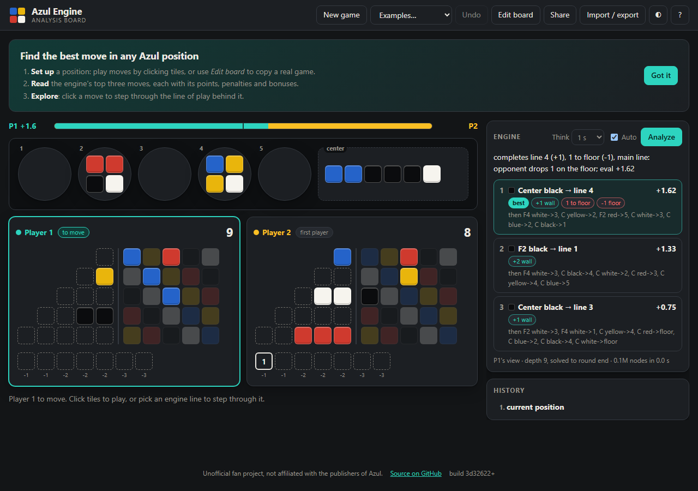

# Azul Engine

[](https://github.com/tusk80/azul-engine/actions/workflows/ci.yml)
[](https://github.com/tusk80/azul-engine/actions/workflows/site.yml)

An engine and analysis board for 2-player Azul (standard wall), written in Go.
It runs two ways from the same code: as one native binary (engine, HTTP API and
web page together), or entirely in the browser as WebAssembly, with no server.

- **Engine**: alpha-beta search that solves the rest of a round exactly when it
  can, with an evaluation tuned by self-play.
- **Analysis board**: play moves, set up any position, see the top 3 moves with
  a point breakdown, and step through each line of play.
- **Browser overlay**: a userscript that shows the suggested move on
  buddyboardgames.com.

**Try it: https://azul.yesil.cc** (runs in your browser, nothing to install)



Unofficial fan project. Azul is a trademark of its publishers; this project is
not affiliated with or endorsed by them.

## Quick start

1. Download the file for your system from the [latest release](https://github.com/tusk80/azul-engine/releases/latest).
2. Run it with no arguments (on Windows, double-click it). It starts the engine
   and opens the analysis board at http://127.0.0.1:8765.
3. Keep its window open; close it to stop.

Or build it yourself (needs Go 1.26+):

```bash
go build -o azul ./cmd/azul
./azul
```

## Analysis board

- **Play**: click tiles in a factory or the center, then a highlighted line or the floor.
  At the end of a round, *Score round* and *Deal next round* (or edit in the real deal).
- **Engine**: the top 3 moves with evals and a breakdown (wall points, bonus, floor
  penalty, first-player token). *Auto* re-analyses after every move.
- **Lines**: click an engine move to step through its line with ◀ ▶ (or the arrow keys);
  the next move is highlighted on the board. *Play to here* makes the moves.
- **Edit board**: pick a color or the eraser, then click factory slots, line cells,
  wall cells or floor slots. The engine checks the position as you go.
- **Share**: copies a link that opens the exact position.
- **Photo**: shows a picture of a real board above the editor while you click its
  tiles in. The picture stays on your device unless you press **Read with AI**,
  which fills the board in using your own Google Gemini or Anthropic API key
  (kept in your browser, sent only to that provider). Check the result: models
  misread tiles.
- **Import / export**: paste a position as JSON or copy the current one.
- **Examples**, a light/dark switch, and optional symbols on tiles for color-blind use.
- **Undo** (Ctrl+Z) and the history list step back.

## Hosting it

**As a static site (no server).** The engine compiles to WebAssembly and runs in
each visitor's browser, so any static host works:

```bash
bash scripts/build-site.sh    # writes site/
```

The `Site` workflow does this on every push and publishes the result to the
`pages` branch: the site in `public/` and a `wrangler.jsonc` beside it. On
Cloudflare, connect the repo, set the production branch to `pages`, leave the
build command empty, deploy with `npx wrangler deploy`, and turn preview
builds off (only the `pages` branch is deployable). Any other static host can
serve `public/` as-is. In the browser the engine searches about a
third as fast as the native binary.

**As a server.** `azul serve -public` adds the limits a public server needs: a
2-second cap per search, several engines, per-visitor rate limits and
same-origin-only API access. See [docs/DEPLOY.md](docs/DEPLOY.md) for systemd,
Caddy, Cloudflare and Docker.

## Browser overlay (buddyboardgames.com)

1. Run the engine (`azul`, or double-click `azul.exe`).
2. Install [Tampermonkey](https://www.tampermonkey.net/) in Chrome.
3. Open [azul-overlay.user.js](https://raw.githubusercontent.com/tusk80/azul-engine/main/userscript/azul-overlay.user.js)
   and press **Install** when Tampermonkey asks.
4. In a 2-player game, a panel shows the suggested move on your turn; the source
   tiles pulse and the target line is outlined. **Alt+A** hides or shows it.
5. **Analyze this position** (or **Alt+S**) opens the current position in the
   analysis board, on either player's turn. This part works without the local
   engine: the position travels in the link itself.

The script reads the page's own game object and only talks to `127.0.0.1`.

Please use it for study, solo practice, or games where everyone at the table
knows about it. Using an engine against people who don't know is cheating.

## Commands

| Command | What it does |
|---|---|
| `azul` | Run the engine and open the analysis board. |
| `azul serve` | The same without opening a browser (`-public` for a public site). |
| `azul analyze state.json` | Search a position in the terminal (`-time 2s`, `-multipv 3`). |
| `azul show state.json` | Print the board and every legal move. |
| `azul selfplay -a W -b W` | Engine-vs-engine match; each deal is played twice with seats swapped. |
| `azul tune -from W` | Tune evaluation weights with SPSA self-play. |
| `azul perft state.json 5` | Count move sequences (move generator check and speed test). |
| `azul random -seed 7` | Play a random game and print each round. |

`W` is `default`, `zero` (points only) or a weights file such as `weights/tuned4.json`.

## HTTP API

| Endpoint | Body | Returns |
|---|---|---|
| `POST /bestmove` | `{"state": {...}, "timeMs": 1000, "multiPV": 3}` | Best move with its effect (points, floor penalty, bonus), `eval` in points for the side to move, `outcome` once the game is decided, the line of play (`pv`), alternatives, and a one-line `reason`. |
| `POST /apply` | `{"state": {...}, "moves": ["F2 red->3", "score", "deal"]}` | Checks a position (no moves) or plays a line, returning every position on the way. |
| `POST /new` | `{"seed": 0}` | A freshly dealt game. |
| `GET /health` | | `{"status":"ok"}` |

Errors are `{"error": "..."}` with status 400 (bad position or move), 422 (no
legal moves), 429 (rate limit) or 503 (all engines busy).

### Positions

See `testdata/opening.json` and `testdata/midround.json`. Walls are 5 strings,
one per row: `.` empty, `x` or the color letter (`B Y R K W`) filled. `floor` is
the number of occupied floor slots including the first-player token. `bag` and
`lid` are optional; when missing they are inferred from the 20-per-color total.

## How strong is it?

For the ideas behind it, see [How the engine works](docs/HOW-IT-WORKS.md).

Measured in self-play, each deal played twice with seats swapped:

| Evaluation | Result |
|---|---|
| Tuned (default) vs points-only | about 92% of games |
| Each round of new evaluation terms | +158 Elo, then about +30 |

At the start of a round it searches about 6 moves deep in a second; later
in the round it solves the round to the end. It does not model the random deal
of the next round beyond its evaluation: an experimental sampling lookahead
(`-look N -lookdepth D`) lost 10–50 Elo at equal work and is off by default.

## Rules decisions

- Scores never go below 0 (placement points are added before floor penalties;
  the clamp applies to the round total).
- If nobody takes the first-player token, the same player starts the next round.
- The engine plays to win first, then to maximise the margin; ties on points
  go to more complete rows.

## Layout

```
game/        rules, move generation, scoring, hashing, JSON, ASCII board
api/         requests and responses, shared by the server and the browser build
search/      alpha-beta (PVS), iterative deepening, transposition table
eval/        evaluation terms and weights
selfplay/    parallel matches and SPSA tuning
server/      HTTP API, limits, and the analysis board (server/ui, embedded)
cmd/azul/    CLI
cmd/wasm/    the engine for the browser (WebAssembly)
scripts/     build-site.sh: the static site
hosting/     headers and Cloudflare config for the static site
userscript/  Tampermonkey overlay for buddyboardgames.com
deploy/      systemd unit and Caddyfile
```

## License

MIT. See [LICENSE](LICENSE).
